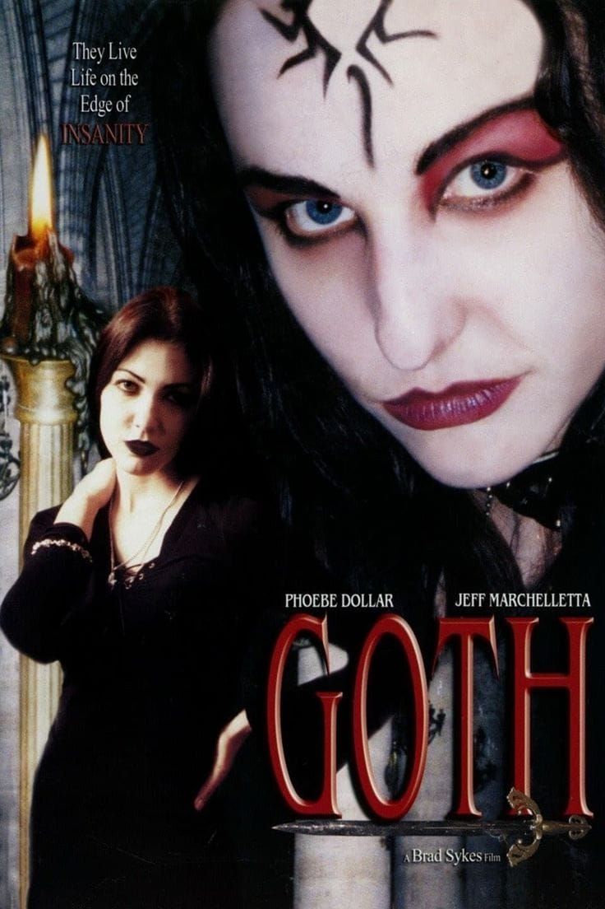

# GOTH

˚₊‧⁺⋆♱  
**The Odin Project — Landing Page**  
˚₊‧⁺⋆♱

 

‿̩͙⊱༒︎༻♱༺༒︎⊰‿̩͙

 

A dark, narrative-driven landing page built for  
**The Odin Project (Foundations)**  
Inspired by the psychological horror film  
<strong>_Goth (2003)_</strong>

---

<table>
  <tr>
    <td align="center">
      
       
      Moonlight sharp enough to cut
    </td>
    <td align="center">
      
       
      Stained glass that remembers your sins
    </td>
  </tr>
</table>

---

## About

This project was created as part of  
**The Odin Project — Landing Page assignment**.

The objective was to build a complete webpage from scratch using  
**HTML, CSS, and basic JavaScript**, focusing on layout, structure, and visual hierarchy.

Rather than a generic business theme, this implementation explores a  
<strong>gothic psychological horror aesthetic</strong>,  
drawing inspiration from the mood, isolation, and memory-based tension of  
**_Goth (2003)_**.

---

## Tech

HTML  
CSS  
JavaScript  

No frameworks.  
No libraries.  
Just foundations.

---

 

‿̩͙⊱༒︎༻♱༺༒︎⊰‿̩͙

 

<strong>Made by GAJEE</strong>  
#GOTH4EVR

